# python_labs

## Лабораторная работа 1

### Задание номер 1
```python
name = input("Имя: ")
age = int(input("Возраст: "))
print(f"Привет, {name}! Через год тебе будет {age + 1}.")
```
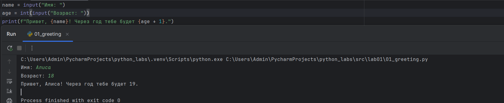

### Заданиет номер 2
```python
number01 = float(input("a: ").replace(",", "."))
number02 = float(input("b: ").replace(",", "."))
print(f"sum={number01 + number02}; avg={round(((number01 + number02) / 2),2)}")
```


### Задание номер 3
```python
price = 1000
discount = 10
vat = 20
base = price * (1 - discount/100)
vat_amount = base * (vat/100)
total = base + vat_amount
print(f"База после скидки: {format(base,'.2f')}")
print(f'НДС: {format(vat_amount,'.2f')}')
print(f"Итого к оплате: {format(total,".2f")}")
```
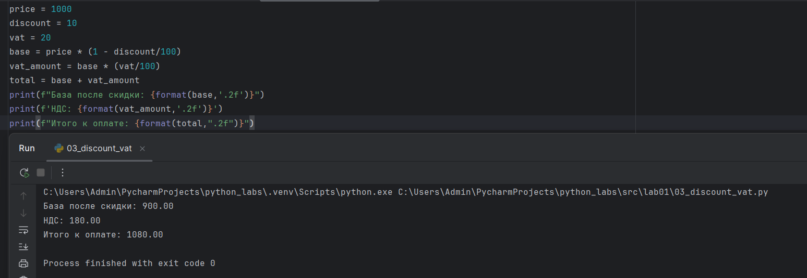

### Задание номер 4
```python
minn = int(input("Минуты: "))
hours = (minn // 60) % 24
minn_time = (minn % 60)
if minn_time < 10:
    minn_time = "0" + str(minn_time)
print(f"{hours}:{minn_time}")
```
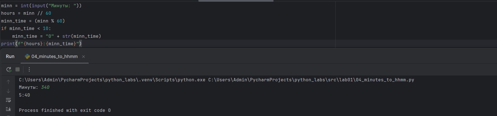

### Задание номер 5
```python
FIO = input("ФИО: ")
countt = 0
while '  ' in FIO:
    FIO = FIO.replace('  ', ' ')
words = FIO.split()
FIO_w_2spases = FIO.rstrip().lstrip()
first_letters = []
str_first_letters = ''
for word in words:
    first_letters.append(word[0])
for letter in first_letters:
    str_first_letters +=  letter
print(f"Инициалы: {str_first_letters}")
print(f"Длина (символов): {len(FIO_w_2spases)}")
```
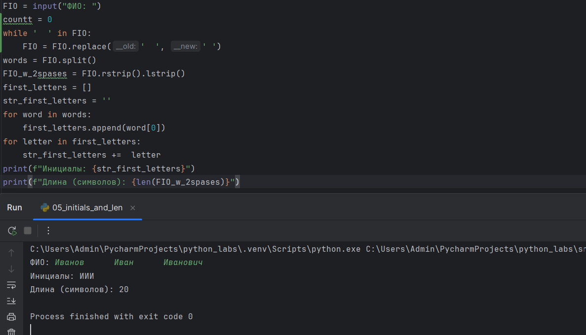

## Задание номер 6
```python
n = int(input("Пришло людей: "))
ochno = zaochno = 0
for i in range(n):
    info = input().split()
    if info[3] == "True":
        ochno += 1
    else:
        zaochno += 1

print(f"Очно: {ochno}; Заочно: {zaochno}")
```
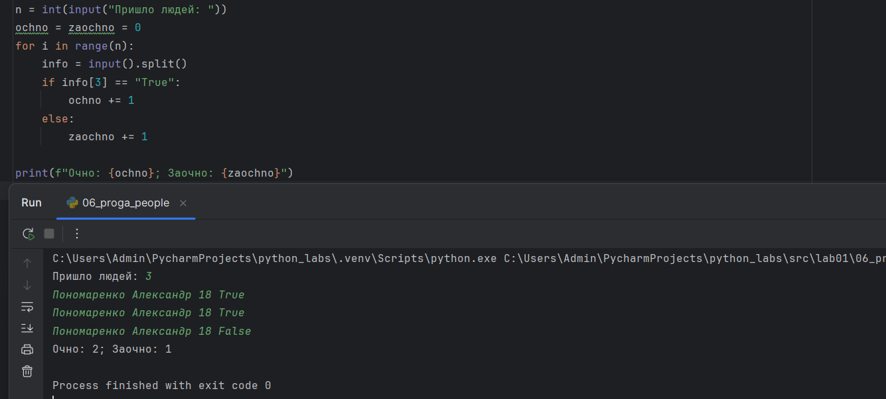

## Лабораторная работа 2

### Задание номер 1
```python
def min_max(nums: list[float | int]) -> tuple[float | int, float | int]:
    
    if len(nums) <= 0:
        raise ValueError
    return (min(nums),max(nums))


def unique_sorted(nums: list[float | int]) -> list[float | int]:
    
    nums = set(nums)
    nums = list(nums)
    return nums


def flatten(mat: list[list | tuple]) -> list:
    
    true_mat = []
    for i in mat:
        if not isinstance(i, (list, tuple)):
            raise TypeError
        for k in i:
            if isinstance(k,str):
                raise   TypeError
            
    for i in range(len(mat)):
        for k in mat[i]:
            true_mat.append(k)
    return true_mat
```
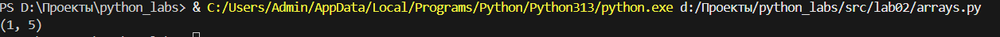
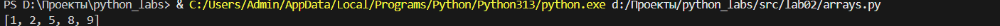
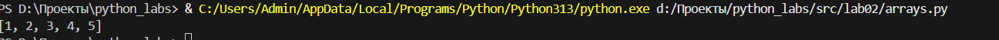

### Задание номер 2

```python
def transpose(mat: list[list[float | int]]) -> list[list]:
    result = []

    if len(mat) == 1 and not mat[0]:
        return []
        
    for i in range(len(mat) - 1):
        if len(mat[i]) < len(mat[i+1]) or (len(mat[i]) > len(mat[i+1])):
            raise ValueError
    
    for i in range(len(mat[0])):
        new_list = []
        for k in range(len(mat)):
            new_list.append(mat[k][i])
        result.append(new_list)
    
    return result

def row_sums(mat: list[list[float | int]]) -> list[float]:
    
    sum_list = []
    
    row_len = len(mat[0])
    for row in mat:
        if len(row) != row_len:
            raise ValueError
        
    for i in range(len(mat)):
        summ = 0
        for k in mat[i]:
            summ += k
        sum_list.append(summ)
    return sum_list

def col_sums(mat: list[list[float | int]]) -> list[float]:

    sum_list = []

    if not mat or not mat[0]:
        return []

    row_len = len(mat[0])
    for row in mat:
        if len(row) != row_len:
            raise ValueError
         
    for i in range (row_len):
        summ = 0
        for k in range(len(mat)):
            summ += mat[k][i]
        sum_list.append(summ)
    
    return sum_list
```

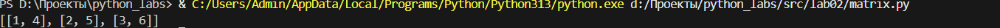
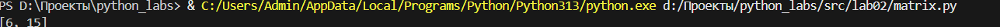
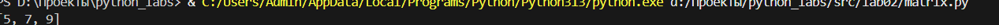

### Задание номер 3

```python
def format_record(rec: tuple[str, str, float]) -> str:
    fio_clean = rec[0].strip()
    FIO = fio_clean.split()

    gpa = round(rec[2], 2)

    if len(FIO) == 3:
        return f"{FIO[0][0].upper()}{FIO[0][1:]} {FIO[1][0].upper()}.{FIO[2][0].upper()}. , гр. {rec[1]}, GPA {gpa:.2f}"
    elif len(FIO) == 2:
        return f"{FIO[0]}{FIO[0][1:]} {FIO[1][0].upper()}. , гр. {rec[1]}, GPA {gpa:.2f}"
    else:
        raise ValueError
    
```
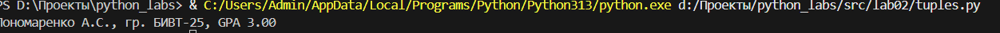

## Лабораторная работа 3

### Задание номер 1

```python
import re

def normalize(text: str, *, casefold: bool = True, yo2e: bool = True) -> str:
    
    if casefold:
        text = text.casefold()
    
    if yo2e:
        text = text.replace('ё','е').replace("Ё","Е")
    
    for ch in ['\n', '\r', '\t']:
        text = text.replace(ch, ' ')
    
    while '  ' in text:
        text = text.replace('  ', ' ')

    return text.strip()

"""
legal_chars = set()

for i in range(65, 123):
    legal_chars.add(chr(i))


for i in range(1040, 1104):
    legal_chars.add(chr(i))

for i in range(0, 10):
    legal_chars.add(str(i)) 

legal_chars.update(['-', '_'])

def tokenize(text: str) -> list[str]:
    
    true_text = ''

    for ch in text:
        
        if ch in legal_chars:
            true_text += ch
        
        else:
            true_text += ' ' 
    
    true_text = normalize(true_text)
    
    return true_text.split()
"""

def tokenize(text: str) -> list[str]:

    text = normalize(text, casefold=True, yo2e=True)
    pattern = r'\w+(?:-\w+)*'

    return re.findall(pattern, text)

def count_freq(tokens: list[str]) -> dict[str, int]:

    sbor = {}

    for i in range (len(tokens)):

        if tokens[i] in sbor:
            continue

        else:
            sbor[tokens[i]] = tokens.count(tokens[i])

    return sbor

def top_n(freq: dict[str, int], n: int = 5) -> list[tuple[str, int]]:

    sorted_items = sorted(freq.items(), key=lambda item: (-item[1], item[0]))
    
    return sorted_items[:n]

```

```python
from src.lib.text import *

print(normalize("ПрИвЕт\nМИр\t"))
print(normalize("ёжик, Ёлка", yo2e=True))
print(normalize("Hello\r\nWorld"))
print(normalize("  двойные   пробелы  "))


print(tokenize("привет мир"))
print(tokenize("hello,world!!!"))
print(tokenize("по-настоящему круто"))
print(tokenize("2025 год"))
print(tokenize("emoji 😀 не слово"))

print(top_n(count_freq(["a", "b", "a", "c", "b", "a"]), n=2))
print(top_n(count_freq(["bb", "aa", "bb", "aa", "cc"]), n=2))
```

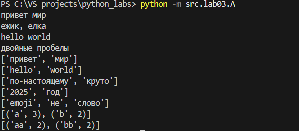

### Задание номер 2

```python
import sys
import os
sys.path.insert(0, os.path.abspath(os.path.join(os.path.dirname(__file__), '..', '..')))
from src.lib.text import*

text = sys.stdin.read()

textn = text

text = normalize(text)
text = tokenize(text)
textn = text
top = top_n(count_freq(text), n = 5)
text = top_n(count_freq(text))


print(f"Всего слов: {len(textn)}")
print(f"Уникальных слов: {len(text)}")
print("Топ-5:")
for word, count in top:
    print(f"{word}: {count}")
```

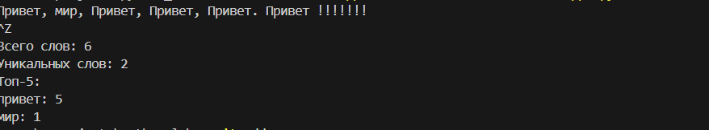

## Лабораторная работа 4

```python
from src.lab04.io_txt_csv import *
from src.lib.text import *

b = read_text("C:\\VSprojects\\python_labs\\data\\lab04\\input.txt")
b = normalize(b)
b = tokenize(b)
b_ = b
b = count_freq(b)
top = top_n(b,5)
b = top_n(b)


write_csv(
    rows = b, 
    path = "C:\\VSprojects\\python_labs\\data\\lab04\\report.csv",
    header=["Word","Count"]
)

print(f"Всего слов: {len(b_)}")
print(f"Уникальных слов: {len(b)}")
print("Топ-5:")
for word, count in top:
    print(f"{word}: {count}")
```

```python
import csv
from pathlib import Path
from typing import Iterable, Sequence

def read_text(path: str | Path, encording: str = "cp1251") -> str:

    p = Path(path)

    if p.exists() == False:
        raise FileNotFoundError
    
    if len(p.read_text(encoding = encording)) <= 0:

        return '' 
    
    return p.read_text(encoding = encording)

def write_csv(rows: Iterable[Sequence], path: str | Path, header: tuple[str, ...] | None = None) -> None:

    p = Path(path)
    rows = list(rows)

    for i in range (len(rows)-1):

        if len(rows[i]) != len(rows[i+1]):
            raise ValueError

    with p.open("w", newline="", encoding="cp1251") as f:
        w = csv.writer(f)

        if header is not None:
            w.writerow(header)

        for r in rows:
            w.writerow(r)
```

### Задание номер А
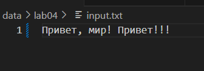
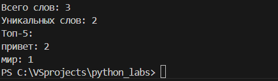
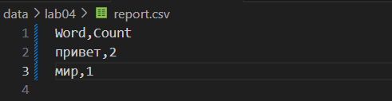

### Задание номер B
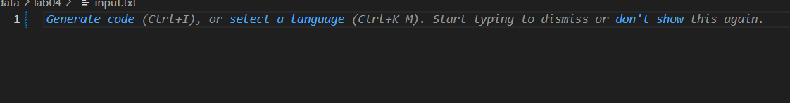
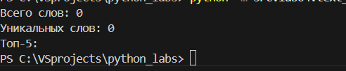
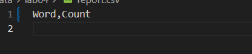

### Задание номер С
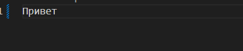
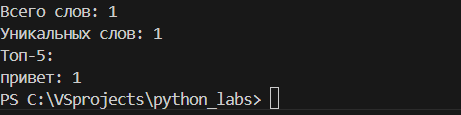
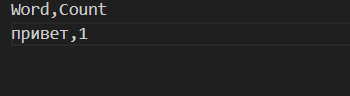

## Лабораторная работа 5
### Задание номер 1

```python
import csv
import json
from pathlib import Path

def json_to_csv(json_path: str, csv_path: str) -> None:
    """
    Преобразует JSON-файл в CSV.
    Поддерживает список словарей [{...}, {...}], заполняет отсутствующие поля пустыми строками.
    Кодировка UTF-8. Порядок колонок — как в первом объекте или алфавитный.
    """

    json_path = Path(json_path)

    if json_path.exists() == False:
        raise FileNotFoundError
    
    if len(json_path.read_text(encoding = "utf-8")) <= 0:
        raise ValueError

    with json_path.open("r",newline="",encoding = 'utf-8') as f:
        json_import = json.load(f)

    csv_path = Path(csv_path)

    with csv_path.open("w", newline="", encoding="utf-8") as f:
        csv_writer = csv.DictWriter(f,fieldnames = ["name",'age','city'])

        csv_writer.writeheader() 
        csv_writer.writerows(json_import)      


def csv_to_json(csv_path: str, json_path: str) -> None:

    json_path = Path(json_path)
    csv_path = Path(csv_path)

    if csv_path.exists() == False:
        raise FileNotFoundError
    
    if len(csv_path.read_text(encoding = "utf-8")) <= 0:
        raise ValueError
    
    list_line_csv = []

    with csv_path.open('r',encoding = 'utf-8') as f:
        csv_read = csv.DictReader(f)
        for line in csv_read:
            list_line_csv.append(line)
    
    with json_path.open("w", newline = '', encoding = "utf-8") as f:
        json_writer = json.dump(list_line_csv,f,ensure_ascii=False, indent = 2)
        
    """
    Преобразует CSV в JSON (список словарей).
    Заголовок обязателен, значения сохраняются как строки.
    json.dump(..., ensure_ascii=False, indent=2)
    """
```


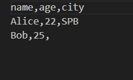


### Задание номер 2

```python
import openpyxl
from pathlib import Path
import csv

def csv_to_xlsx(csv_path: str, xlsx_path: str) -> None:
    """
    Конвертирует CSV в XLSX.
    Использовать openpyxl ИЛИ xlsxwriter.
    Первая строка CSV — заголовок.
    Лист называется "Sheet1".
    Колонки — автоширина по длине текста (не менее 8 символов).
    """
    csv_path = Path(csv_path)
    xlsx_path = Path(xlsx_path)

    if csv_path.exists() == False:
        raise FileNotFoundError
    
    if len(csv_path.read_text(encoding = "utf-8")) <= 0:
        return ""
    
    xlsx_book = openpyxl.Workbook()
    xlsx_sheet1 = xlsx_book.active
    xlsx_sheet1.title = "Sheet1"

    with csv_path.open('r',encoding = 'utf-8') as f:
        csv_read = csv.reader(f)
        
        for row in csv_read:
            xlsx_sheet1.append(row)


    xlsx_book.save(xlsx_path)
```


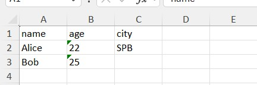

## Лабораторная работа 6
### Задание номер 1
```python
import argparse
from src.lib.text import count_freq, tokenize, normalize, top_n
from pathlib import Path

def main():
    parser = argparse.ArgumentParser(description="CLI‑утилиты лабораторной №6")
    subparsers = parser.add_subparsers(dest="command")

    cat_parser = subparsers.add_parser("cat", help="Вывести содержимое файла")
    cat_parser.add_argument("--input", required=True)
    cat_parser.add_argument("-n", action="store_true", help="Нумеровать строки")

    stats_parser = subparsers.add_parser("stats", help="Частоты слов")
    stats_parser.add_argument("--input", required=True)
    stats_parser.add_argument("--top", type=int, default=5)

    args = parser.parse_args()

    if args.command == "cat":
        """ Реализация команды cat """

        with Path(args.input).open("r", newline='', encoding = 'utf8') as f:
            people = f.read()
            list_p = people.split()

        count = 0

        if args.n:
            for peo in list_p:
                count += 1
                print(f"{count} {peo}")

        else:
            for peo in list_p:
                print(f"{peo}")

    elif args.command == "stats":
        """ Реализация команды stats """

        with Path(args.input).open("r", newline='', encoding = 'utf8') as f:
            people = f.read()

        final = top_n(count_freq(tokenize(normalize(people))), args.top)

        for word, count in final:
            print(f"{word}: {count}")
        
if __name__ == "__main__":
    main()
```


### Задание номер 2

```python
import argparse
from src.lib.text import count_freq, tokenize, normalize, top_n
from pathlib import Path

def main():
    parser = argparse.ArgumentParser(description="CLI‑утилиты лабораторной №6")
    subparsers = parser.add_subparsers(dest="command")

    cat_parser = subparsers.add_parser("cat", help="Вывести содержимое файла")
    cat_parser.add_argument("--input", required=True)
    cat_parser.add_argument("-n", action="store_true", help="Нумеровать строки")

    stats_parser = subparsers.add_parser("stats", help="Частоты слов")
    stats_parser.add_argument("--input", required=True)
    stats_parser.add_argument("--top", type=int, default=5)

    args = parser.parse_args()

    if args.command == "cat":
        """ Реализация команды cat """

        with Path(args.input).open("r", newline='', encoding = 'utf8') as f:
            people = f.read()
            list_p = people.split()

        count = 0

        if args.n:
            for peo in list_p:
                count += 1
                print(f"{count} {peo}")

        else:
            for peo in list_p:
                print(f"{peo}")

    elif args.command == "stats":
        """ Реализация команды stats """

        with Path(args.input).open("r", newline='', encoding = 'utf8') as f:
            people = f.read()

        final = top_n(count_freq(tokenize(normalize(people))), args.top)

        for word, count in final:
            print(f"{word}: {count}")
        
if __name__ == "__main__":
    main()
```


## Лабораторная работа 7
### Задание номер 1

```python
import pytest
from src.lib.text import normalize, tokenize, count_freq, top_n


@pytest.mark.parametrize(
    "source, expected",
    [
        ("ПрИвЕт\nМИр\t", "привет мир"),
        ("ёжик, Ёлка", "ежик, елка"),
        ("Hello\r\nWorld", "hello world"),
        ("  двойные   пробелы  ", "двойные пробелы"),
        ("", ""),
        ("\n\t\r", ""),
        ("    a    b    ", "a b"),
    ],
)
def test_normalize_basic(source, expected):
    assert normalize(source) == expected


@pytest.mark.parametrize(
    "source, expected",
    [
        ("привет мир", ["привет", "мир"]),
        ("hello,world!!!", ["hello", "world"]),
        ("по-настоящему круто", ["по-настоящему", "круто"]),
        ("2025 год", ["2025", "год"]),
        ("emoji 😀 не слово", ["emoji", "не", "слово"]),
        ("", []),
        ("\n\t\r", []),
    ],
)
def test_tokenize_basic(source, expected):
    assert tokenize(source) == expected


def test_count_freq_and_top_n():
    freq = count_freq(["a", "b", "a", "c", "b", "a"])
    assert freq == {"a": 3, "b": 2, "c": 1}
    assert top_n(freq, 2) == [("a", 3), ("b", 2)]
    freq = count_freq([])
    assert freq == {}
    freq = count_freq(["один"])
    assert freq == {"один": 1}


def test_top_n_tie_breaker():
    freq = count_freq(["bb", "aa", "bb", "aa", "cc"])
    assert top_n(freq, 2) == [("aa", 2), ("bb", 2)]
    freq = count_freq(["z", "y", "x"])
    assert top_n(freq, 2) == [("x", 1), ("y", 1)]
    freq = count_freq(["a", "b"])
    assert top_n(freq, 5) == [("a", 1), ("b", 1)]
```


### Задание номер 2

```python
import csv
import json
from pathlib import Path

import pytest

from src.lab05.json_csv import csv_to_json, json_to_csv


def write_json(path: Path, obj):
    path.write_text(json.dumps(obj, ensure_ascii=False, indent=2), encoding="utf-8")


def read_csv_rows(path: Path):
    with path.open(encoding="utf-8") as f:
        return list(csv.DictReader(f))


def test_json_to_csv_basic(tmp_path: Path):
    src = tmp_path / "people.json"
    dst = tmp_path / "people.csv"
    data = [{"name": "Alice", "age": 22}, {"name": "Bob", "age": 25}]
    write_json(src, data)
    json_to_csv(str(src), str(dst))
    rows = read_csv_rows(dst)
    assert len(rows) == 2
    assert set(rows[0]) >= {"name", "age"}


def test_json_to_csv_missing_fields(tmp_path: Path):
    src = tmp_path / "incomplete.json"
    dst = tmp_path / "incomplete.csv"
    data = [{"name": "Alice", "age": 22}, {"name": "Bob"}]
    write_json(src, data)
    json_to_csv(str(src), str(dst))
    rows = read_csv_rows(dst)
    assert len(rows) == 2
    assert "age" in rows[1]


def test_csv_to_json_basic(tmp_path: Path):
    src = tmp_path / "people.csv"
    dst = tmp_path / "people.json"
    src.write_text("name,age\nAlice,22\nBob,25\n", encoding="utf-8")
    csv_to_json(str(src), str(dst))
    obj = json.loads(dst.read_text(encoding="utf-8"))
    assert isinstance(obj, list) and len(obj) == 2
    assert set(obj[0]) == {"name", "age"}
    assert obj[0]["name"] == "Alice"


def test_csv_to_json_cyrillic(tmp_path: Path):
    src = tmp_path / "russian.csv"
    dst = tmp_path / "russian.json"
    src.write_text("имя,возраст\nАлиса,22\n", encoding="utf-8")
    csv_to_json(str(src), str(dst))
    obj = json.loads(dst.read_text(encoding="utf-8"))
    assert obj[0]["имя"] == "Алиса"


def test_json_to_csv_empty_raises(tmp_path: Path):
    src = tmp_path / "empty.json"
    src.write_text("[]", encoding="utf-8")
    with pytest.raises(ValueError):
        json_to_csv(str(src), str(tmp_path / "out.csv"))


def test_json_to_csv_invalid_raises(tmp_path: Path):
    src = tmp_path / "invalid.json"
    src.write_text("{bad}", encoding="utf-8")
    with pytest.raises(ValueError):
        json_to_csv(str(src), str(tmp_path / "out.csv"))


def test_csv_to_json_empty_raises(tmp_path: Path):
    src = tmp_path / "empty.csv"
    src.write_text("", encoding="utf-8")
    with pytest.raises(ValueError):
        csv_to_json(str(src), str(tmp_path / "out.json"))


def test_csv_to_json_no_data_raises(tmp_path: Path):
    src = tmp_path / "no_data.csv"
    src.write_text("name,age\n", encoding="utf-8")
    with pytest.raises(ValueError):
        csv_to_json(str(src), str(tmp_path / "out.json"))


def test_json_to_csv_missing_file_raises():
    with pytest.raises(FileNotFoundError):
        json_to_csv("nope.json", "out.csv")


def test_csv_to_json_missing_file_raises():
    with pytest.raises(FileNotFoundError):
        csv_to_json("nope.csv", "out.json")
```

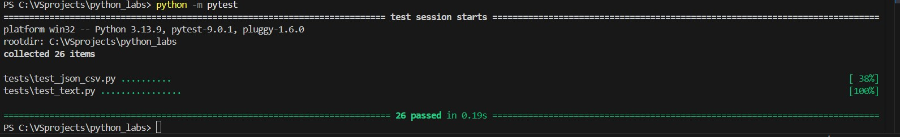

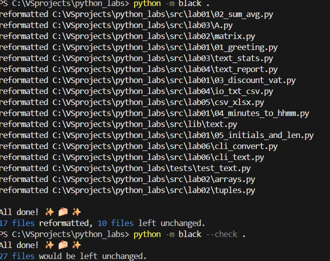