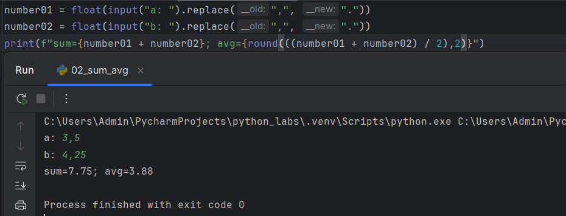

# python_labs

## Лабораторная работа 1

### Задание номер 1
```python
name = input("Имя: ")
age = int(input("Возраст: "))
print(f"Привет, {name}! Через год тебе будет {age + 1}.")
```


### Заданиет номер 2
```python
number01 = float(input("a: ").replace(",", "."))
number02 = float(input("b: ").replace(",", "."))
print(f"sum={number01 + number02}; avg={round(((number01 + number02) / 2),2)}")
```


### Задание номер 3
```python
price = 1000
discount = 10
vat = 20
base = price * (1 - discount/100)
vat_amount = base * (vat/100)
total = base + vat_amount
print(f"База после скидки: {format(base,'.2f')}")
print(f'НДС: {format(vat_amount,'.2f')}')
print(f"Итого к оплате: {format(total,".2f")}")
```


### Задание номер 4
```python
minn = int(input("Минуты: "))
hours = (minn // 60) % 24
minn_time = (minn % 60)
if minn_time < 10:
    minn_time = "0" + str(minn_time)
print(f"{hours}:{minn_time}")
```


### Задание номер 5
```python
FIO = input("ФИО: ")
countt = 0
while '  ' in FIO:
    FIO = FIO.replace('  ', ' ')
words = FIO.split()
FIO_w_2spases = FIO.rstrip().lstrip()
first_letters = []
str_first_letters = ''
for word in words:
    first_letters.append(word[0])
for letter in first_letters:
    str_first_letters +=  letter
print(f"Инициалы: {str_first_letters}")
print(f"Длина (символов): {len(FIO_w_2spases)}")
```


## Задание номер 6
```python
n = int(input("Пришло людей: "))
ochno = zaochno = 0
for i in range(n):
    info = input().split()
    if info[3] == "True":
        ochno += 1
    else:
        zaochno += 1

print(f"Очно: {ochno}; Заочно: {zaochno}")
```


## Лабораторная работа 2

### Задание номер 1
```python
def min_max(nums: list[float | int]) -> tuple[float | int, float | int]:
    
    if len(nums) <= 0:
        raise ValueError
    return (min(nums),max(nums))


def unique_sorted(nums: list[float | int]) -> list[float | int]:
    
    nums = set(nums)
    nums = list(nums)
    return nums


def flatten(mat: list[list | tuple]) -> list:
    
    true_mat = []
    for i in mat:
        if not isinstance(i, (list, tuple)):
            raise TypeError
        for k in i:
            if isinstance(k,str):
                raise   TypeError
            
    for i in range(len(mat)):
        for k in mat[i]:
            true_mat.append(k)
    return true_mat
```


### Задание номер 2

```python
def transpose(mat: list[list[float | int]]) -> list[list]:
    result = []

    if len(mat) == 1 and not mat[0]:
        return []
        
    for i in range(len(mat) - 1):
        if len(mat[i]) < len(mat[i+1]) or (len(mat[i]) > len(mat[i+1])):
            raise ValueError
    
    for i in range(len(mat[0])):
        new_list = []
        for k in range(len(mat)):
            new_list.append(mat[k][i])
        result.append(new_list)
    
    return result

def row_sums(mat: list[list[float | int]]) -> list[float]:
    
    sum_list = []
    
    row_len = len(mat[0])
    for row in mat:
        if len(row) != row_len:
            raise ValueError
        
    for i in range(len(mat)):
        summ = 0
        for k in mat[i]:
            summ += k
        sum_list.append(summ)
    return sum_list

def col_sums(mat: list[list[float | int]]) -> list[float]:

    sum_list = []
    
    row_len = len(mat[0])
    for row in mat:
        if len(row) != row_len:
            raise ValueError
         
    for i in range(len(mat[0])):
        summ = 0
        for k in range(len(mat)):
            summ += mat[k][i]
        sum_list.append(summ)
    
    return sum_list
```


### Задание номер 3

```python
def format_record(rec: tuple[str, str, float]) -> str:
    fio_clean = rec[0].strip()
    FIO = fio_clean.split()

    gpa = round(rec[2], 2)

    if len(FIO) == 3:
        return f"{FIO[0][0].upper()}{FIO[0][1:]} {FIO[1][0].upper()}.{FIO[2][0].upper()}. , гр. {rec[1]}, GPA {gpa:.2f}"
    elif len(FIO) == 2:
        return f"{FIO[0]}{FIO[0][1:]} {FIO[1][0].upper()}. , гр. {rec[1]}, GPA {gpa:.2f}"
    else:
        raise ValueError
    
```

